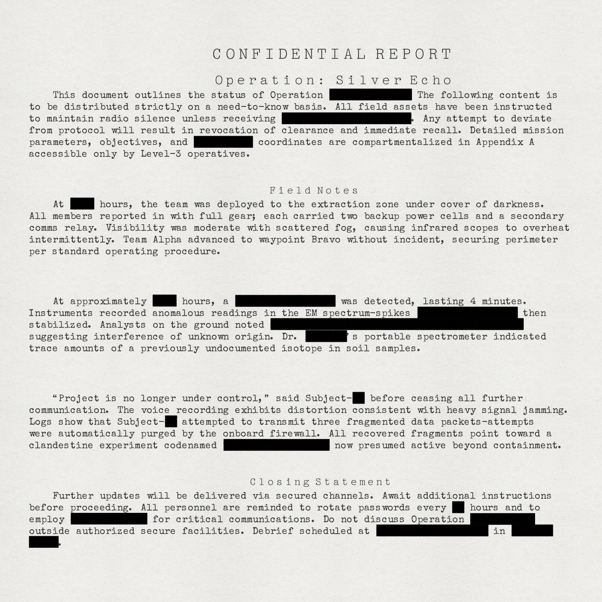

# secret-ink
A pseudo-document generator to look like "top secret" documents from markdown files.

## Run

```sh
cargo run
```

The desktop studio starts with `profile.toml`, `input.md`, and the configured font and paper files. Use the Browse buttons to choose different files, adjust the page and ink settings, and save changes back to the active TOML profile.

Update Preview renders a proof with its longest side limited to 768 pixels. Render Full Size writes the configured PNG output, and Open Image launches that file in the system's default image viewer.

## Example

